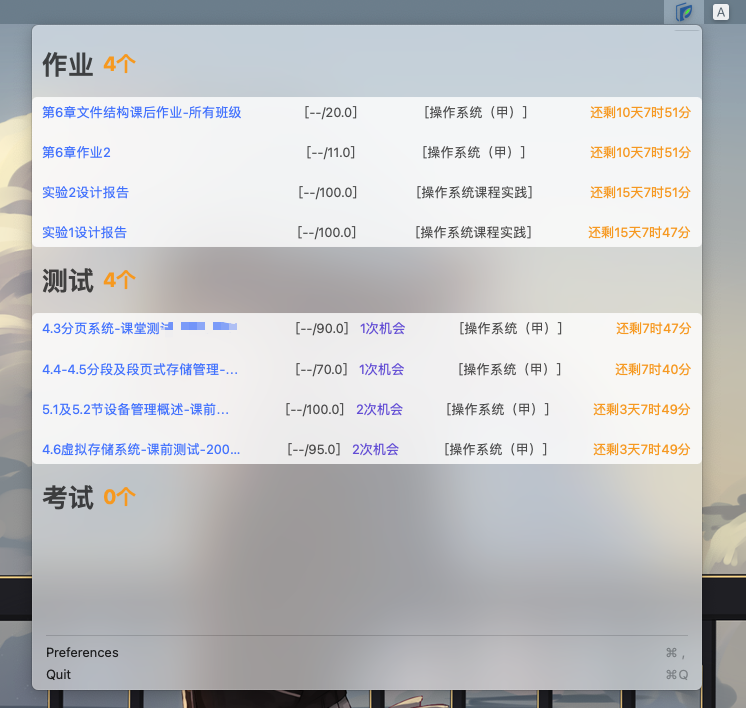

  <h1><code>ZjoocHelper</code></h3>
  
<em>A homework helper in your menu bar!</em>

  
  
  

## 🧐 What is it

ZjoocHelper is a component in your menu bar, which is developed for helping you not miss your homework. Have a good time! ❤️

## 📷 Screenshot

## 🍻 Download

- Way1: 

- Way2: `brew install zacharywin/tap/zjoochelper`

## ©️ License

[MIT](LICENSE)
